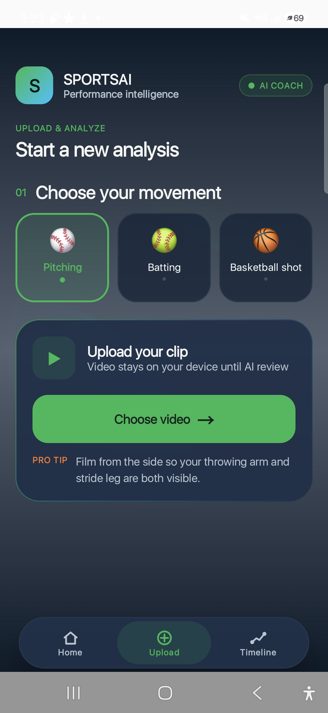
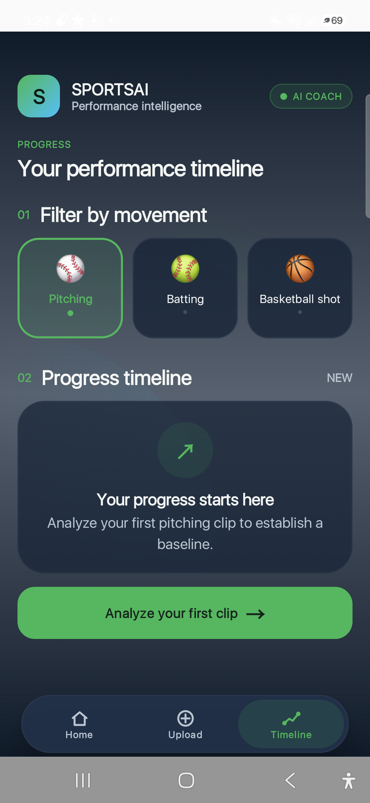

# SportsAI

SportsAI is an Android coaching app that turns sports clips into practical technique feedback. It combines on-device ML Kit pose detection with optional Gemini multimodal analysis, then presents strengths, opportunities, drills, skeleton playback, and progress over time.

> **Status:** active prototype. Feedback is educational and is not a replacement for a qualified coach, clinician, or medical professional.

## Final experience

<p align="center">
  
  
  
</p>

The project began as a single simple upload screen and evolved into a full three-destination athlete dashboard. See the complete [development journey](docs/DEVELOPMENT_JOURNEY.md), including an authentic before/after comparison.

## Features

- **Three supported movements:** baseball pitching, baseball batting, and basketball shooting
- **On-device pose tracking:** samples video frames and detects body landmarks with ML Kit
- **Optional Gemini coaching:** sends a small set of selected frames for multimodal technique feedback
- **Offline fallback:** an explainable biomechanics rules engine produces feedback if Gemini is unavailable
- **Skeleton replay:** overlays tracked joints and bones on analyzed motion
- **Structured report:** overall score, strengths, issues, and actionable drills
- **Progress timeline:** manually assign a filming date and compare scores across sessions
- **Private local history:** session summaries are stored in app-private storage
- **Premium Compose UI:** responsive dashboard, compact floating navigation, dark/light themes, and accessible progress semantics
- **Adaptive icon:** color and Android 13+ monochrome launcher artwork

## How it works

```text
Video selected with Android Photo Picker
        |
        v
MediaMetadataRetriever samples frames
        |
        v
ML Kit Accurate Pose Detection (on device)
        |
        +-------------------------------+
        |                               |
        v                               v
Explainable biomechanics rules     Selected JPEG frames
(always available)                 sent to Gemini when configured
        |                               |
        +---------------+---------------+
                        v
                 TechniqueReport
                        |
                        v
          Compose results + local timeline
```

More detail is available in [Architecture](docs/ARCHITECTURE.md).

## Requirements

- Android Studio with Android SDK 36
- JDK 17 or newer
- Android 10 / API 29 or newer device or emulator
- Optional: a Gemini API key from [Google AI Studio](https://aistudio.google.com/apikey)

## Setup

1. Clone the repository:

   ```powershell
   git clone https://github.com/HajinJoo/SportsAI.git
   Set-Location SportsAI
   ```

2. Open the project in Android Studio and allow Gradle sync to finish.

3. For optional Gemini feedback, add this line to your local `local.properties` file:

   ```properties
   GEMINI_API_KEY=your_new_key_here
   ```

   `local.properties` is intentionally ignored by Git. Never commit an API key.

4. Build and test:

   ```powershell
   .\gradlew.bat testDebugUnitTest lintDebug assembleDebug
   ```

5. Install on a connected device:

   ```powershell
   adb install -r app\build\outputs\apk\debug\app-debug.apk
   ```

On macOS or Linux, use `./gradlew` and `/` path separators.

## Keyless mode

The project builds without `GEMINI_API_KEY`. In that mode, SportsAI uses the local pose pipeline and sport-specific biomechanics rules. This is also how public CI verifies the repository without secrets.

## API-key warning

Android client secrets can be extracted from an APK, even when supplied through `BuildConfig`. The current key approach is intended for development and personal prototypes only. A production release should call Gemini through an authenticated backend with quotas, abuse protection, and key rotation.

If a key has ever been posted publicly, revoke it in Google AI Studio and generate a new one.

## Filming tips

- Keep the athlete's full body visible.
- Record from the side recommended by the selected sport.
- Use bright, even lighting and a steady camera.
- Avoid other people crossing the frame.
- Use short clips focused on one movement repetition.

## Privacy

Pose detection runs locally. When Gemini is configured, selected image frames are transmitted to Google's Gemini API for analysis. Timeline entries remain in app-private local storage. Read the complete [Privacy Notes](docs/PRIVACY.md) before testing with another person's video.

## Project structure

```text
app/src/main/java/com/example/sportsai/
|-- data/        # Pose analysis, Gemini client, rules, local history
|-- model/       # Sports, poses, reports, timeline entries
|-- ui/          # Premium dashboard and skeleton rendering
|-- ui/theme/    # Color, typography, shapes
`-- viewmodel/   # Analysis state and orchestration
```

## Documentation

- [Development journey](docs/DEVELOPMENT_JOURNEY.md)
- [Architecture](docs/ARCHITECTURE.md)
- [Privacy notes](docs/PRIVACY.md)
- [Security policy](SECURITY.md)
- [Contributing](CONTRIBUTING.md)

## License

Licensed under the [Apache License 2.0](LICENSE).

