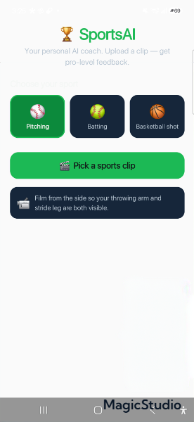
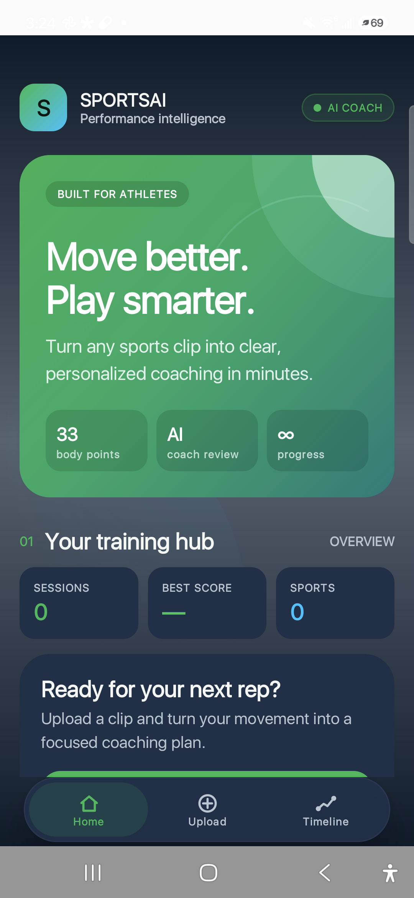

# Development Journey

This document records how SportsAI evolved during its initial development session. It is a product narrative based on the retained source files and completed implementation—not fabricated historical Git commits. Git was initialized only after the prototype reached its public-release state.

## Before and after

| Original single-screen prototype | Final premium dashboard |
| --- | --- |
|  |  |

The original interface is still represented by `ui/HomeScreen.kt`. The final application entry point uses `ui/PremiumDashboard.kt`.

## 1. The initial idea

The starting idea was simple: choose a baseball or sports clip, let AI inspect the athlete's movement, explain what is good and what needs work, and recommend ways to improve.

The first user flow contained:

1. A SportsAI title
2. A few sport chips
3. A video picker button
4. A progress indicator
5. A score and text findings

It proved the flow, but it looked like a basic Android prototype and had no long-term athlete experience.

## 2. Building the pose pipeline

`PoseAnalyzer` became the core on-device computer-vision layer:

- `MediaMetadataRetriever` samples frames from the selected clip.
- ML Kit Accurate Pose Detection finds body landmarks.
- Frame timestamps and landmark confidence are retained.
- A representative key frame is selected.
- Downscaled frame/pose pairs are produced for replay.

This kept the expensive pose work local and made the feedback pipeline independent from the UI.

## 3. Adding explainable biomechanics feedback

`TechniqueAnalyzer` added sport-specific local coaching rules for:

- Baseball pitching
- Baseball batting
- Basketball shooting

The rules inspect joint angles, knee flexion, trunk movement, alignment, balance, and detection quality. This created an offline fallback and made feedback possible even without a cloud API key.

## 4. Adding optional Gemini coaching

`GeminiCoach` added multimodal review:

- Selects a small spread of analyzed frames
- Compresses them as JPEG
- Requests strict JSON output
- Parses score, summary, strengths, issues, and tips
- Falls back to the local rules engine on configuration or network failure

The app intentionally remains usable when Gemini is not configured.

## 5. Visualizing what the model saw

Two Compose renderers made pose tracking understandable:

- `SkeletonOverlay` draws a skeleton on a representative frame.
- `AnimatedSkeleton` loops analyzed frames with the tracked body.

The overlay was refined to show only major body joints above a confidence threshold, reducing visual noise and jitter. Replay can be tapped to pause or continue.

## 6. Expanding movement support

The sport model grew from pitching into three focused movement types. Each has:

- A display name and visual marker
- A filming recommendation
- A dedicated biomechanics path
- A separate progress timeline

The scope is intentionally honest: the current analyzer does not claim to support every sport.

## 7. Creating progress history

A lightweight `HistoryRepository` stores analyzed sessions as JSON in app-private storage. Each entry contains:

- Sport
- User-selected filming date
- Score
- Summary

The app asks for the filming date rather than extracting video metadata. Sessions are sorted chronologically and compared with the previous score.

## 8. Adding the timeline

The timeline introduced:

- Latest, best, and change statistics
- A score trend chart
- Per-session score deltas
- Sport filtering
- Delete confirmation
- Empty-state guidance

This shifted SportsAI from a one-time analyzer toward a training companion.

## 9. Designing a visual identity

The default Android purple template was replaced by an athletic visual system:

- Court green primary color
- Field navy surfaces
- Cyan tracking accent
- Orange energy accent
- Semantic green, amber, blue, and red feedback colors
- Complete typography and shape scales

A custom adaptive launcher icon combined a trophy, sports ball, motion trail, and connected AI nodes. A monochrome layer supports Android 13+ themed icons.

## 10. Rebuilding the UI

The final UI was rebuilt as `PremiumSportsDashboard` with:

- Layered gradient and radial backgrounds
- A compact brand bar
- A bold athlete-focused hero
- Clear upload and filming guidance
- Animated two-stage analysis feedback
- Responsive score gauge
- Media-first motion replay
- Structured coaching insight groups
- Better contrast and explicit content colors

A contrast audit fixed black text inherited by translucent custom surfaces.

## 11. Adding real app navigation

The original all-in-one scroll was split into three destinations:

### Home

An overview with quick-start actions, training statistics, and the latest session.

### Upload

Sport selection, clip picking, analysis progress, errors, and full results.

### Timeline

Sport filtering, charts, summary statistics, and session management.

One shared `AnalysisViewModel` lives above the tabs, so switching destinations does not cancel analysis or lose results.

## 12. Refining the bottom bar

The standard thick Material navigation bar was replaced by a compact floating control:

- 60dp-high rounded surface
- Maximum 340dp width
- Close to the safe bottom edge
- 48–50dp accessible tab targets
- Custom line icons
- Circular selected state
- Upload status dot for analyzing, ready, and error states

## 13. Public-release preparation

Before publication, the project received:

- Strict ignore rules for local keys and generated output
- Keyless CI builds
- Privacy and security documentation
- Apache 2.0 licensing
- Authentic before/after screenshots
- Secret scanning and clean-build verification

## 14. Reopening historical analyses

Timeline dates and chart endpoint dates became interactive. A saved session now retains enough structured data to rebuild the complete score, overview, metric, finding, and highlight result instead of opening only a summary row.

## 15. Adding sport-specific improvement metrics

Each movement received a dedicated 0–100 metric set and filterable trend view. The timeline shows whether a metric improved, declined, or stayed level compared with the previous session. Speed entries are explicitly described as pose-based potential scores—not radar-measured ball or bat speed—and ball tracking is presented as a visual/head-stability signal.

## 16. Adding AI skill overviews

Both Gemini and the offline rules path now produce a concise 3–4 sentence overview. It identifies the athlete's current level, strongest metric, clearest opportunity, and a practical direction for the next comparison.

## 17. Creating real editable highlights

Pose timing now identifies peak action, best form, and sport-specific release/contact moments. Android's local media APIs cut those ranges into private MP4 files. Tapping a highlight opens real video playback, and the in-app editor can adjust the start/end boundaries and replace the saved cut.

## 18. Making highlights focused and dependable

Real-device testing exposed two weaknesses in the first highlight pass: a normal tap used the generated file while the editor used the more reliable source URI, and keyframe-based remuxing could include video from well before the selected action. Playback now opens the exact source range immediately and falls back to the private clip only when needed. Media3 Transformer creates precise replacement clips, while a smoothed, body-normalized selector chooses one complete sport-specific action using release-arm speed and extension for pitching, hand speed and torso rotation for batting, or upward release, elbow extension, and leg drive for basketball shooting. Static poses and isolated one-frame tracking jumps are rejected.

## Final architecture snapshot

```text
Photo Picker
    -> PoseAnalyzer (ML Kit, local)
    -> TechniqueAnalyzer (local fallback)
    -> GeminiCoach (optional selected-frame analysis)
    -> HighlightExtractor (AI moment selection)
    -> VideoClipExporter (private MP4 cut/edit)
    -> AnalysisViewModel
    -> PremiumSportsDashboard
    -> HistoryRepository (local timeline)
```

## What remains for production

- Move Gemini calls behind an authenticated backend
- Add user accounts and encrypted cloud sync if desired
- Validate coaching ranges with qualified sport professionals
- Add automated Compose UI and screenshot tests
- Add camera capture and clip trimming
- Add more movements only with dedicated mechanics and test data
- Complete accessibility review with TalkBack and large font settings

SportsAI should continue to present itself as an educational coaching aid—not a medical assessment or a substitute for in-person coaching.

